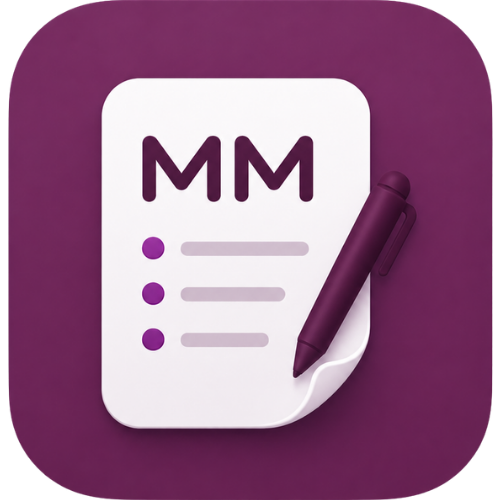

<p align="center">
  
</p>

<h1 align="center">Meeting Minutes</h1>

<p align="center">
  
  
  
</p>

A native macOS app that records your meetings (Zoom, Google Meet, Teams, or
anything else), transcribes them, and generates AI meeting minutes — with
everything stored locally on your Mac.

It works with **any** meeting app because it captures the system audio mix
rather than integrating with a specific client. Your microphone and the
meeting's audio are recorded as **separate tracks**, so transcripts can tell
"You" apart from the other participants for free.

> ⚠️ **Recording notice:** Recording meetings may require the consent of all
> participants depending on your jurisdiction. Make sure you have permission
> before recording.

## Status

🚧 Early development. Built in vertical slices:

- [x] **Phase 1 — Capture:** two-track recording (mic + system audio) to `.m4a`
- [x] **Phase 2 — Transcription:** local `whisper.cpp` (multilingual `small` model), per-track speaker labels, pluggable cloud
- [x] **Phase 3 — Minutes:** Claude API (`claude-opus-4-8`) → summary, decisions, action items
- [x] **Phase 4 — Library:** sidebar of past meetings, full-text transcript search, audio playback
- [ ] **Phase 5 — Polish:** notarized release, consent flow

## Requirements

- macOS 14 (Sonoma) or later
- Xcode 16 or later (developed against Xcode 26)
- Apple Silicon recommended

## Quick start (one command)

No Apple developer account required:

```sh
git clone https://github.com/IamJunnn/MeetingMinute.git
cd MeetingMinute
./scripts/install.sh
```

This builds the app (ad-hoc signed if you have no team set) and installs it to
`/Applications`. Launch it from Spotlight (⌘-Space → "Meeting Minutes"). The
first build compiles whisper.cpp from source, so it takes a few minutes.

## Build & run in Xcode

For development:

```sh
# Optional but recommended: set your signing team so macOS keeps permission
# grants across rebuilds (otherwise it re-prompts each build).
cp Local.xcconfig.example Local.xcconfig
#   then edit Local.xcconfig and set DEVELOPMENT_TEAM to your Apple team ID

open MeetingMinutes.xcodeproj
```

Select the **MeetingMinutes** scheme and press **Run** (⌘R).

`Local.xcconfig` is git-ignored, so your team ID never lands in the repo. If you
leave it unset and Xcode complains about signing, open **Signing &
Capabilities** and either pick your team or set the signing certificate to
**"Sign to Run Locally"** — both build a runnable local app.

On first launch the app shows an onboarding screen and asks for two permissions:

1. **Microphone** — to record your voice.
2. **Screen & System Audio Recording** — required by macOS's ScreenCaptureKit
   API to capture the meeting's audio (the other participants). The app does not
   record your screen.

> 🔑 After granting **Screen Recording**, quit and reopen the app — macOS only
> applies that permission on a fresh launch. See [Troubleshooting](#troubleshooting).

## How it works

```
 ┌──────────────┐     ┌──────────────────────────┐
 │ Microphone   │──▶  │ AVAudioEngine → mic.m4a   │
 └──────────────┘     └──────────────────────────┘
 ┌──────────────┐     ┌──────────────────────────┐
 │ System audio │──▶  │ ScreenCaptureKit          │
 │ (the others) │     │   → system.m4a            │
 └──────────────┘     └──────────────────────────┘
```

Recordings (and their transcripts, once generated) are saved to:

```
~/Library/Application Support/MeetingMinutes/Recordings/<timestamp>/
    mic.m4a           your microphone
    system.m4a        the other participants
    transcript.txt    merged, time-ordered, speaker-labeled
    transcript.json   structured segments
    minutes.md        AI-generated minutes (after "Generate Minutes")
```

## Generating minutes

Minutes generation works with your choice of provider — **Claude (Anthropic)**,
**OpenAI (ChatGPT)**, **Google Gemini**, or a fully-local **Ollama** model. Open
**Settings** (the gear icon), pick a provider, paste its API key (Ollama needs
none), optionally set a model, and Save. Keys are stored in the macOS
**Keychain**, never on disk or in git. Then click **Generate Minutes** on a
transcribed recording to produce a summary, key decisions, and action items,
saved as `minutes.md`.

With **Ollama** the whole pipeline runs offline — transcription is already local,
and minutes are generated by a model on your Mac, so nothing leaves the device.
The cloud providers send the transcript text to that provider.

Transcription runs **locally** with whisper.cpp — no audio leaves your Mac and
no API key is needed. Each track is transcribed separately, so lines are
labeled `You` (mic) vs. `Participant` (system audio). The multilingual `small`
model (~466 MB) is downloaded once on first use into `…/MeetingMinutes/Models/`.

## Project layout

```
MeetingMinutes/
├── App/             SwiftUI entry point
├── Capture/         Microphone + system-audio capture, session orchestration
├── Transcription/   whisper.cpp transcriber, model download, audio decode/merge
├── Minutes/         Claude API client, Keychain storage, minutes generation
├── Library/         Past-meeting store (filesystem-backed), audio playback
├── Permissions/     Microphone + Screen Recording permission tracking
├── Models/          Shared data types (TranscriptLine)
└── Views/           UI
```

Built on [SwiftWhisper](https://github.com/exPHAT/SwiftWhisper) (a Swift wrapper
over [whisper.cpp](https://github.com/ggerganov/whisper.cpp)).

## Troubleshooting

**It keeps asking for Screen Recording / "The user declined TCCs".**
macOS only applies a Screen Recording grant on a fresh launch, and a changing
code signature makes it forget the grant. Fix both:

1. Set your team in `Local.xcconfig` (see [Build & run](#build--run)) so the
   signature is stable across rebuilds.
2. Grant **Screen & System Audio Recording** in System Settings, then **quit and
   reopen** the app.
3. If it's stuck in a denied state, reset and retry:
   ```sh
   tccutil reset ScreenCapture build.ecoblox.MeetingMinutes
   tccutil reset Microphone build.ecoblox.MeetingMinutes
   ```

**"No Anthropic API key set."** Minutes generation needs a key — open Settings
(the gear icon) and add one. Recording and transcription work without it.

**The first transcription is slow / downloads a lot.** The multilingual `small`
Whisper model (~466 MB) downloads once into `…/MeetingMinutes/Models/`.

## Contributing

See [CONTRIBUTING.md](CONTRIBUTING.md). Contributions are welcome — the next
milestone is Phase 4 (a searchable library of past meetings).

## License

[MIT](LICENSE)
